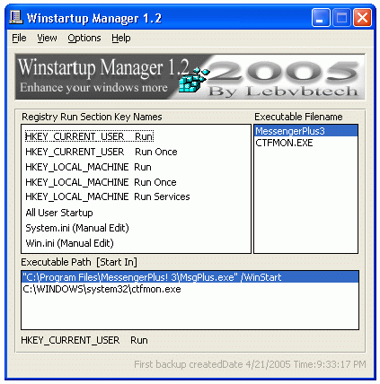



## Winstartup manager v 1\.2 \(FIXED\) Open Source

### Description

This is the 3rd release of Winstartup Manager and it's (v 1.2). As the name says it manage all startup items in registry "Run" sections that usually executed when you reach your windows desktop. This version has been enhanced more to be user friendly as well as the registry key sections has been fixed from the image list to option boxes and added some nice features in the upper menus, check them yourself please and if its desire voting will be appriciated thank you .

I will say thanks a lot for the following cool people out there that reminded and comment me for the previous version 1.2 that has some bugs in the optionbox control regarding the "selregentry" var .

Ian Brooke

KwickDoc

Mark F

JK

M@rkS

apidude 'Iam working also on that services thingy you remind me about yes :)

SPY-3

Thank you guys :)

Winstartup Manager 1.2 is open source and you might help me out if you likre, because i want to add the function like reading the services in windows XP also .
 
### More Info
 

             |
---                |---
**Submitted On**   |2005-04-21 21:33:00
**By**             |[kegham](https://github.com/Planet-Source-Code/PSCIndex/blob/master/ByAuthor/kegham.md)
**Level**          |Intermediate
**User Rating**    |5.0 (20 globes from 4 users)
**Compatibility**  |VB 5\.0, VB 6\.0
**Category**       |[Windows System Services](https://github.com/Planet-Source-Code/PSCIndex/blob/master/ByCategory/windows-system-services__1-35.md)
**World**          |[Visual Basic](https://github.com/Planet-Source-Code/PSCIndex/blob/master/ByWorld/visual-basic.md)
**Archive File**   |[Winstartup1881024252005\.zip](https://github.com/Planet-Source-Code/kegham-winstartup-manager-v-1-2-fixed-open-source__1-60209/archive/master.zip)

